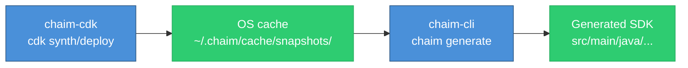
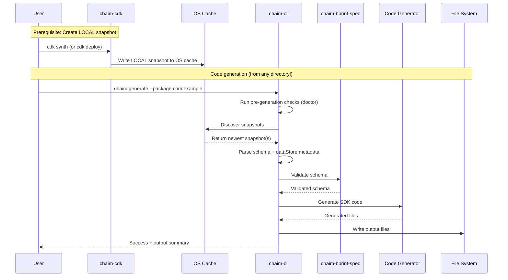

# AI Agent Context: chaim-cli

**Purpose**: Structured context for AI agents to understand and work with the chaim-cli codebase.

**Package**: `@chaim-tools/chaim` (published as `chaim` CLI binary)  
**Version**: 0.1.0  
**License**: Apache-2.0

---

## Project Overview

chaim-cli is a **schema-driven code generator** that reads `.bprint` snapshots from the OS cache and produces type-safe SDKs with DTOs and data access clients.

**Current System Support** 

| Provider      | Resource            | Supported Languages     |
|---------------|---------------------|------------------------|
| AWS           | DynamoDB tables     | Java                   |

### Prerequisite

> **IMPORTANT**: The CLI requires LOCAL snapshots from `chaim-cdk`. You must run `cdk synth` or `cdk deploy` before using `chaim generate`.

```bash
# In your CDK project (creates LOCAL snapshots in OS cache)
cdk synth   # Creates LOCAL snapshot for code generation
cdk deploy  # Also creates LOCAL snapshot + publishes to Chaim SaaS

# Then run the CLI (from your Java application directory)
chaim generate --package com.mycompany.myapp.model
```

### Key Capabilities

- **Prerequisites Management**: Verify and install all required dependencies for the current provider
- **Language-Specific SDK Generation**: Generate complete SDKs from LOCAL snapshots (Java-first implementation)
- **Schema Validation**: Validate `.bprint` files using `@chaim-tools/chaim-bprint-spec`
- **Environment Diagnostics**: Check system environment and dependency health
- **Snapshot Discovery**: Automatically find and select the appropriate snapshot from OS cache
- **Works From Any Directory**: No need to be in the CDK project directory
- **Extensible Code Generation**: Structured to support additional language generators (e.g., Kotlin, Python)

### Scope

This CLI currently targets **AWS-based deployments only**, consuming LOCAL snapshots produced by `chaim-cdk`.

---

## Related Packages

| Package | Relationship | Purpose |
|---------|-------------|---------|
| `@chaim-tools/cdk-lib` | **Upstream** | Produces LOCAL snapshot files that CLI consumes |
| `@chaim-tools/chaim-bprint-spec` | **Shared** | Schema format definition, validation |
| `@chaim-tools/client-java` | **Code generator** | Java SDK generation |

> **Contract**: The CLI depends on the `LocalSnapshotPayload` structure written by `chaim-cdk`. Changes to the snapshot format in `chaim-cdk` must be reflected in the CLI's type definitions (`src/types/snapshot-payload.ts`).

**Data flow**:


> 🔵 **Blue** = Commands you run &nbsp;&nbsp;|&nbsp;&nbsp; 🟢 **Green** = Automatically created

---

## Technology Stack

| Component | Technology |
|-----------|------------|
| Language | TypeScript 5.x |
| Module System | CommonJS (`"type": "commonjs"`) |
| Runtime | Node.js 18+ |
| CLI Framework | Commander.js 11.x |
| Terminal Styling | Chalk 4.x |
| Progress Spinners | Ora 5.x |
| Testing | Vitest 1.x |
| Code Quality | ESLint, TypeScript strict mode |
| Cloud Integration | AWS SDK v3 (current provider implementation) |

---

## Repository Structure

```
chaim-cli/
├── src/
│   ├── index.ts                         # CLI entry point and command registration
│   ├── commands/
│   │   ├── init.ts                      # Prerequisites verification and installation
│   │   ├── generate.ts                  # SDK generation from snapshots
│   │   ├── validate.ts                  # Schema file validation
│   │   └── doctor.ts                    # Environment health checks
│   ├── services/
│   │   ├── snapshot-discovery.ts        # Snapshot file discovery and resolution
│   │   └── os-cache-paths.ts            # OS cache directory utilities
│   └── types/
│       ├── index.ts                     # Type exports
│       └── snapshot-payload.ts          # Snapshot and metadata type definitions
├── shared/
│   ├── examples/
│   │   └── orders.bprint                # Sample schema file
│   └── scripts/
│       └── setup.sh                     # Setup script for development
├── dist/                                # Compiled output (generated)
├── package.json
├── tsconfig.json
└── README.md
```

---

## CLI Commands

### `chaim init`

Verifies and installs all prerequisites required for the Chaim CLI to function.

```bash
chaim init [options]
```

| Option | Description | Default |
|--------|-------------|---------|
| `--install` | Install missing dependencies automatically | false |
| `--verify-only` | Verify prerequisites only (no installation) | false |
| `--region <region>` | AWS region for CDK bootstrap | us-east-1 |

---

### `chaim generate`

Generates language-specific SDK from LOCAL snapshot files produced by `chaim-cdk`. Defaults to Java if no language is specified.

**Prerequisite**: Run `cdk synth` or `cdk deploy` in your CDK project first.

```bash
chaim generate --package <packageName> [--language <language>] [options]
```

| Option | Type | Required | Description | Default |
|--------|------|----------|-------------|---------|
| `--package` | string | **Yes** | Package name (e.g., `com.mycompany.myapp.model` for Java) | - |
| `-l, --language` | string | No | Target language for code generation | java |
| `--output` | string | No | Output directory | ./src/main/java |
| `--stack` | string | No | Filter by CDK stack name | - |
| `--snapshot-dir` | string | No | Override snapshot directory (default: OS cache) | - |
| `--skip-checks` | boolean | No | Skip environment validation | false |

**Supported Languages:**
- `java` (default) — generates Java DTOs, ChaimConfig, and ChaimMapperClient

**Snapshot Selection:**
- The CLI reads LOCAL snapshots from the OS cache
- Snapshots are sorted by `capturedAt` (from payload), newest first
- The newest snapshot is automatically selected
- Use `--stack` to filter to a specific stack if needed

**Multi-Entity Generation:**

The CLI discovers and generates from **all matching snapshots**. One entity class is generated per snapshot.

**Examples:**
```bash
# Generate all entities into a flat package structure (defaults to Java)
chaim generate --package com.mycompany.myapp.model

# Explicitly specify language
chaim generate --package com.mycompany.myapp.model --language java

# Filter by stack name
chaim generate --package com.mycompany.myapp.model --stack MyStack

# Override snapshot directory
chaim generate --package com.mycompany.myapp.model --snapshot-dir /custom/path

# Skip pre-generation checks
chaim generate --package com.mycompany.myapp.model --skip-checks
```

**Error: No snapshot found**

If no snapshot is found, the CLI will:

1. **Instruct you to run CDK** - Snapshots are created by `chaim-cdk`:
   ```bash
   cdk synth   # Creates LOCAL snapshot
   cdk deploy  # Also creates LOCAL snapshot + publishes to Chaim SaaS
   ```

2. **Show the expected path structure** - Where snapshots should be located

3. **Show applied filters** - If `--stack` was used

4. **List existing snapshots** - If any snapshots exist but didn't match your criteria

**Common causes:**
- You haven't run `cdk synth` or `cdk deploy` yet
- Your `--stack` filter doesn't match any snapshots
- Snapshots are in a different location (use `--snapshot-dir` to override)

---

### `chaim validate`

Validates a `.bprint` schema file against the Chaim specification.

```bash
chaim validate <schemaFile>
```

---

### `chaim doctor`

Checks system environment and dependencies for proper configuration.

```bash
chaim doctor
```

---

## Snapshot Locations

The CLI reads LOCAL snapshots from a **global OS cache**. This allows the CLI to work from any directory without requiring access to the CDK project.

### OS Cache Locations

**Default:**
- macOS/Linux: `~/.chaim/cache/snapshots/`
- Windows: `%LOCALAPPDATA%/chaim/cache/snapshots/`

**Override:** Set `CHAIM_SNAPSHOT_DIR` environment variable, or use `--snapshot-dir` flag.

### Directory Structure

```
~/.chaim/cache/snapshots/
└── aws/
    └── {accountId}/
        └── {region}/
            └── {stackName}/
                └── {datastoreType}/
                    └── {resourceId}.json
```

> **Note**: When CDK synthesizes with unresolved tokens (environment-agnostic stacks), `{accountId}` and/or `{region}` may be `unknown`. The CLI handles this by resolving region from `AWS_REGION` or `AWS_DEFAULT_REGION` environment variables, falling back to `us-east-1`.

### Example

```
~/.chaim/cache/snapshots/
└── aws/
    └── 123456789012/
        └── us-east-1/
            └── MyStack/
                └── dynamodb/
                    ├── UsersTable__User.json
                    └── UsersTable__AuditLog.json
```

### Example with Unresolved Tokens

When CDK uses environment-agnostic stacks:

```
~/.chaim/cache/snapshots/
└── aws/
    └── unknown/
        └── unknown/
            └── MyStack/
                └── dynamodb/
                    └── UsersTable__User.json
```

### Resource ID Format

`{resourceName}__{entityName}[__N]`

- `resourceName`: User-provided display label
- `entityName`: Entity name from `.bprint` schema
- `__N`: Optional collision suffix

### Snapshot Selection

The CLI selects snapshots using these rules:
1. Find all snapshots matching filters (--stack if provided)
2. Sort by `capturedAt` timestamp (from payload), descending
3. Select the newest snapshot(s)

### Region Resolution

When generating code, the CLI resolves region values using this priority:

1. **Snapshot region** - Use region from snapshot if valid (not `unknown`)
2. **AWS_REGION** - Environment variable
3. **AWS_DEFAULT_REGION** - Environment variable
4. **Default** - Falls back to `us-east-1`

This ensures generated `ChaimConfig.java` has a valid region even when CDK synthesizes with environment-agnostic stacks that produce `unknown` values.

### Package Name vs Schema Entity Name

The CLI separates two distinct concepts:

| Concept | Source | Purpose | Example |
|---------|--------|---------|---------|
| **Java Package** | `--package` flag | Where generated files live in your codebase | `com.mycompany.myapp.model` |
| **Entity Name** | `schema.entityName` | Domain/entity identifier in the schema | `User`, `Order`, `Product` |

**Flat Structure:** All DTOs are generated into the single package specified by `--package`:

```bash
chaim generate --package com.mycompany.myapp.model
```

```
src/main/java/com/mycompany/myapp/model/
├── User.java           # from schema entityName: User
├── Order.java          # from schema entityName: Order  
├── ChaimConfig.java
└── ChaimMapperClient.java
```

This follows Java best practices:
- **Reverse domain naming** for packages (`com.mycompany...`)
- **Simple entity names** in schemas (`user`, `order`)
- **All related DTOs** in one coherent package

---

## LOCAL Snapshot Payload Structure

The CLI consumes `LocalSnapshotPayload` written by `chaim-cdk`. This is the contract between the two packages.

### LocalSnapshotPayload Fields

| Field | Type | Description |
|-------|------|-------------|
| `provider` | `'aws'` | Cloud provider |
| `accountId` | string | AWS account ID (may be `'unknown'`) |
| `region` | string | AWS region (may be `'unknown'`) |
| `stackName` | string | CDK stack name |
| `datastoreType` | string | Data store type (e.g., `'dynamodb'`) |
| `resourceName` | string | User-provided display label |
| `resourceId` | string | Generated ID: `{resourceName}__{entityName}[__N]` |
| `identity` | object | Stable identity for collision detection |
| `appId` | string | Application ID from CDK binder props |
| `schema` | object | Validated `.bprint` schema data |
| `dataStore` | object | Data store metadata (DynamoDB, etc.) |
| `context` | object | CDK stack context |
| `capturedAt` | string | ISO 8601 timestamp |

### DynamoDB Metadata (dataStore)

The CLI extracts these fields from DynamoDB snapshots for code generation:

| Field | Description | Used In |
|-------|-------------|---------|
| `tableName` | Table name | `ChaimConfig.TABLE_NAME` |
| `tableArn` | Table ARN | `ChaimConfig.TABLE_ARN` |
| `region` | AWS region | `ChaimConfig.REGION` |
| `partitionKey` | Partition key attribute | Key mapping |
| `sortKey` | Sort key attribute (optional) | Key mapping |
| `globalSecondaryIndexes` | GSI configurations | Index-aware queries |
| `localSecondaryIndexes` | LSI configurations | Index-aware queries |

### Schema Data (schema)

Schema v1.1 - flattened structure:

| Field | Description | Used In |
|-------|-------------|---------|
| `schemaVersion` | Schema version (number: 1.1) | Version tracking |
| `entityName` | Entity name | Class name |
| `description` | Entity description | Documentation |
| `primaryKey` | Key configuration | Repository methods |
| `primaryKey.partitionKey` | Partition key field name | Key mapping |
| `primaryKey.sortKey` | Sort key field name (optional) | Key mapping |
| `fields` | Field definitions | DTO properties |
| `annotations` | Schema annotations (optional) | Metadata |

---

## Code Generation Flow

### End-to-End Process



### Generated Output Structure (Java Example)

```
./src/main/java/
└── com/
    └── example/
        └── model/
            ├── User.java           # Entity DTO
            ├── UserRepository.java # Data store operations
            └── ChaimConfig.java    # Client configuration
```

---

## Package Exports

### npm Installation

```bash
npm install -g @chaim-tools/chaim
```

### Binary Entry Point

```bash
chaim <command> [options]
```

---

## Development Commands

| Command | Purpose |
|---------|---------|
| `npm run build` | Compile TypeScript to dist/ |
| `npm test` | Run Vitest test suite |
| `npm run lint` | Run ESLint |
| `npm run dev` | Run CLI in development mode (ts-node) |
| `npm run clean` | Remove dist/ |

> **Note**: Dependencies (`@chaim-tools/client-java`, etc.) are installed from npm, not bundled locally.

---

## Key Files Reference

| File | Purpose |
|------|---------|
| `src/index.ts` | CLI entry point, Commander.js setup, command registration |
| `src/commands/init.ts` | Prerequisites verification and dependency installation |
| `src/commands/generate.ts` | SDK generation from snapshots, region resolution |
| `src/commands/validate.ts` | Schema validation using chaim-bprint-spec |
| `src/commands/doctor.ts` | Environment health checks |
| `src/services/snapshot-discovery.ts` | Snapshot file discovery and resolution |
| `src/services/os-cache-paths.ts` | OS cache directory utilities |
| `src/types/snapshot-payload.ts` | TypeScript types for snapshot payloads and metadata |
| `src/types/index.ts` | Type exports for the types module |

---

## Integration with Chaim Ecosystem

### Dependencies

| Package | Purpose |
|---------|---------|
| `@chaim-tools/chaim-bprint-spec` | Schema validation and TypeScript types |
| `@chaim-tools/cdk-lib` | Produces LOCAL snapshot files (upstream dependency) |
| `@chaim-tools/client-java` | Code generation (Java implementation) |

### Workflow with Other Packages

1. **Define Schema** (`chaim-bprint-spec`)
   - Create `.bprint` schema files defining entity structure
   
2. **Create LOCAL Snapshot** (`chaim-cdk`)
   - Bind schemas to data stores using CDK constructs
   - Run `cdk synth` or `cdk deploy`
   - LOCAL snapshots written to OS cache (`~/.chaim/cache/snapshots/`)
   - Snapshot contains: schema, dataStore metadata, context, identity
   
3. **Generate SDK** (`chaim-cli`)
   - Discover and read LOCAL snapshot files from OS cache
   - Parse `LocalSnapshotPayload` and extract schema + metadata
   - Resolve `unknown` region values from environment
   - Generate SDK code using language-specific generator
   - *Current*: Java code via `chaim-client-java`

### Type Alignment

The CLI maintains local type definitions that mirror the CDK's `LocalSnapshotPayload`:

| CLI Type | CDK Type | Purpose |
|----------|----------|---------|
| `LocalSnapshotPayload` | `LocalSnapshotPayload` | Snapshot structure |
| `DynamoDBMetadata` | `DynamoDBMetadata` | Table metadata |
| `StackContext` | `StackContext` | CDK context |
| `TableMetadata` | (CLI-only) | Java generator adapter |

---

## Configuration File (Optional)

Create `chaim.json` in your project root to avoid repeating CLI options:

```json
{
  "defaults": {
    "package": "com.example.model",
    "output": "./src/main/java",
    "stack": "MyStack"
  }
}
```

Then run without arguments:
```bash
chaim generate
```

---

## Error Handling

### Common Errors

| Error | Cause | Resolution |
|-------|-------|------------|
| `No snapshot found` | Missing LOCAL snapshot | Run `cdk synth` or `cdk deploy` in your CDK project first |
| `--package is required` | Missing Java package | Provide `--package <name>` option |
| `No matching snapshots` | Stack filter doesn't match | Remove or adjust `--stack` filter |
| `AWS credentials not configured` | Missing AWS auth | Run `aws configure` |
| `Schema validation failed` | Invalid `.bprint` file | Fix schema per error message |

### No Snapshot Found

The most common error is "No snapshot found". **LOCAL snapshots are a prerequisite** - you must run `cdk synth` or `cdk deploy` before using `chaim generate`.

**Why this happens:**
1. **CDK not run**: You haven't run `cdk synth` or `cdk deploy` yet
2. **Stack filter mismatch**: Your `--stack` filter doesn't match any snapshots
3. **Custom snapshot directory**: Snapshots are in a non-default location

**Resolution:**
```bash
# Navigate to your CDK project directory
cd my-cdk-project

# Create a LOCAL snapshot (choose one)
cdk synth    # Creates LOCAL snapshot
cdk deploy   # Creates LOCAL snapshot + publishes to Chaim SaaS

# Then run the CLI (from any directory!)
chaim generate --package com.example.model

# If you have filters, try without them first to see what's available
chaim generate --package com.example.model
# Then add filters based on what snapshots exist
```

---

## Field Type Mappings (Java)

| `.bprint` Type | Java Type |
|----------------|-----------|
| `string` | `String` |
| `number` | `Double` |
| `boolean` | `Boolean` |
| `timestamp` | `Instant` |

---

**Note**: This document reflects the chaim-cli architecture as a TypeScript-based CLI tool. The CLI consumes LOCAL snapshot files from the OS cache produced by `chaim-cdk` and generates type-safe SDKs. LOCAL snapshots are required; the CLI does not make any API calls. The current implementation targets AWS (DynamoDB) with Java SDK generation.
