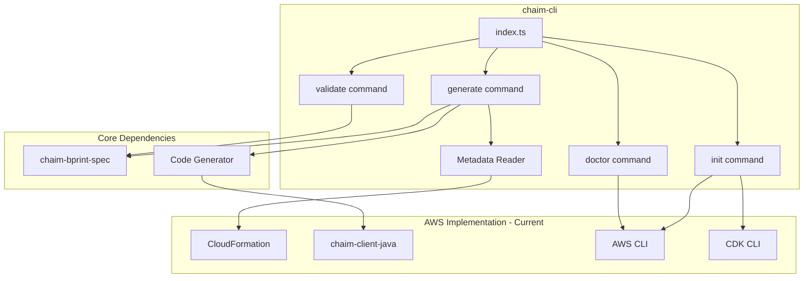
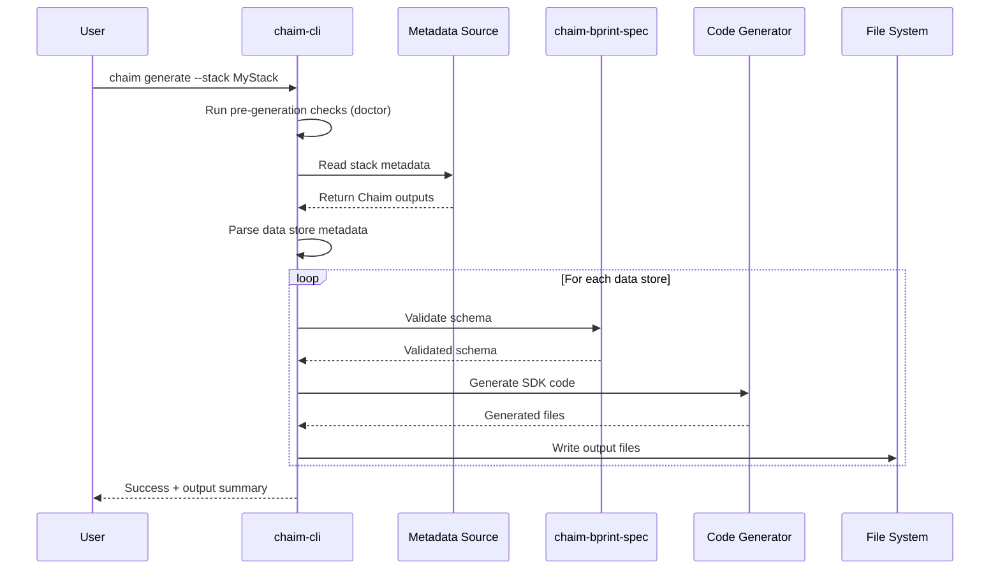
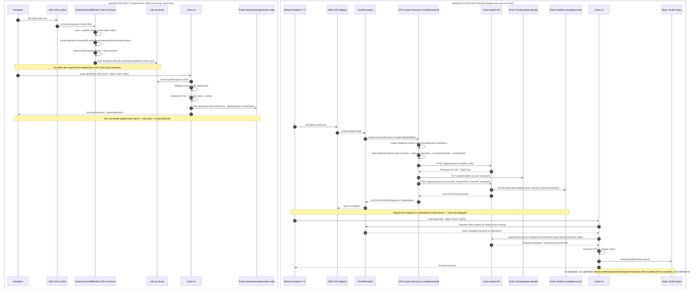
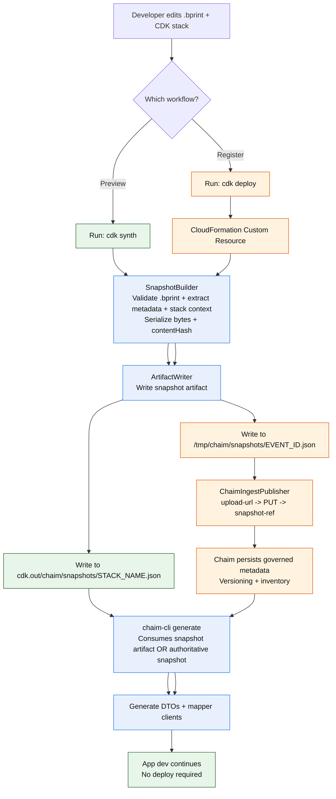

# AI Agent Context: chaim-cli

**Purpose**: Structured context for AI agents to understand and work with the chaim-cli codebase.

**Package**: `@chaim-tools/chaim` (published as `chaim` CLI binary)  
**Version**: 0.1.0  
**License**: Apache-2.0

---

## Project Overview

The chaim-cli is a **schema-driven code generation tool** that transforms `.bprint` schema definitions into complete, language-specific SDKs with data access clients, DTOs, and configuration management. It reads metadata from deployed infrastructure stacks to extract schema and resource configuration, then generates type-safe code.

**Current Implementation**: AWS (CloudFormation stacks, DynamoDB tables) with Java SDK generation.

### Key Capabilities

- **Prerequisites Management**: Verify and install all required dependencies for the current provider
- **Language-Specific SDK Generation**: Generate complete SDKs from deployed infrastructure stacks (Java-first implementation)
- **Schema Validation**: Validate `.bprint` files using `@chaim-tools/chaim-bprint-spec`
- **Environment Diagnostics**: Check system environment and dependency health
- **Infrastructure Metadata Integration**: Read stack outputs to extract Chaim metadata (AWS/CloudFormation in current implementation)
- **Extensible Code Generation**: Structured to support additional language generators (e.g., Kotlin, Python) without changing schema or ingestion behavior

### Scope

This CLI currently targets **AWS-based deployments only**, using CloudFormation as the metadata source.

Support for other cloud providers and on-prem environments will be introduced via separate provider-specific adapters, all consuming the same Chaim ingestion contracts.

---

## Technology Stack

| Component | Technology |
|-----------|------------|
| Language | TypeScript 5.x |
| Module System | CommonJS (`"type": "commonjs"`) |
| Runtime | Node.js 18+ |
| CLI Framework | Commander.js 11.x |
| Terminal Styling | Chalk 4.x |
| Progress Spinners | Ora 5.x |
| Testing | Vitest 1.x |
| Code Quality | ESLint, TypeScript strict mode |
| Cloud Integration | AWS SDK v3 (current provider implementation) |

---

## Repository Structure

```
chaim-cli/
├── src/
│   ├── index.ts                         # CLI entry point and command registration
│   └── commands/
│       ├── init.ts                      # Prerequisites verification and installation
│       ├── generate.ts                  # SDK generation from infrastructure stacks
│       ├── validate.ts                  # Schema file validation
│       ├── doctor.ts                    # Environment health checks
│       └── cloudformation-reader.ts     # Infrastructure metadata reader (AWS implementation)
├── shared/
│   ├── examples/
│   │   └── orders.bprint                # Sample schema file
│   └── scripts/
│       └── setup.sh                     # Setup script for development
├── dist/                                # Compiled output (generated)
├── bundled-deps/                        # Bundled dependencies for offline/reproducible generation (generated)
├── package.json
├── tsconfig.json
└── README.md
```

---

## Architecture

### CLI Command Structure

```
chaim (CLI entry point)
├── init        # Prerequisites verification and installation
├── generate    # SDK generation from infrastructure stack
├── validate    # Schema file validation
└── doctor      # Environment health checks
```

### Component Dependencies



---

## CLI Commands

### `chaim init`

Verifies and installs all prerequisites required for the Chaim CLI to function.

```bash
chaim init [options]
```

| Option | Description | Default |
|--------|-------------|---------|
| `--install` | Install missing dependencies automatically | false |
| `--verify-only` | Verify prerequisites only (no installation) | false |
| `--region <region>` | AWS region for CDK bootstrap | us-east-1 |

**Prerequisites Checked:**
- Node.js version (requires v18+)
- Java installation (requires 11+)
- AWS CLI availability and configuration
- CDK CLI installation
- AWS credentials validity
- CDK bootstrap status

**Dependencies Installed (with `--install`):**
- CDK CLI (if missing): `npm install -g aws-cdk`
- chaim-cli dependencies
- CDK bootstrap (if not already done)

---

### `chaim generate`

Generates language-specific SDK from a deployed infrastructure stack containing Chaim metadata.

**Current Implementation**: Reads AWS CloudFormation stacks and generates Java SDKs.

```bash
chaim generate --stack <stackName> --package <packageName> [options]
```

| Option | Type | Required | Description | Default |
|--------|------|----------|-------------|---------|
| `--stack` | string | Yes | Infrastructure stack name (CloudFormation in AWS) | - |
| `--package` | string | Yes | Target package name (e.g., `com.example.model` for Java) | - |
| `--region` | string | No | AWS region | us-east-1 |
| `--table` | string | No | Specific table name to generate | All tables |
| `--output` | string | No | Output directory | ./src/main/java |
| `--skip-checks` | boolean | No | Skip environment validation | false |

**Example:**
```bash
chaim generate --stack MyAppStack --package com.myapp.model --output ./generated
```

---

### `chaim validate`

Validates a `.bprint` schema file against the Chaim specification.

```bash
chaim validate <schemaFile>
```

| Argument | Type | Required | Description |
|----------|------|----------|-------------|
| `schemaFile` | string | Yes | Path to the `.bprint` file to validate |

**Example:**
```bash
chaim validate ./schemas/user.bprint
```

**Output on Success:**
```
🔍 Validating schema: ./schemas/user.bprint
✓ Schema is valid
  Entity: userId
  Version: v1
  Fields: 5
```

---

### `chaim doctor`

Checks system environment and dependencies for proper configuration.

```bash
chaim doctor
```

**Checks Performed:**
- Node.js version
- AWS CLI availability
- AWS credentials configuration
- Java availability
- AWS SDK availability

**Example Output:**
```
🔍 Checking system environment...
✓ Node.js version: v20.10.0
✓ AWS credentials configured
  Account: 123456789012
  User: arn:aws:iam::123456789012:user/developer
✓ Java version: 17.0.9
✓ AWS SDK available
✓ All checks passed
```

---

## Infrastructure Metadata Integration

The CLI reads metadata from deployed infrastructure stacks to drive code generation. The metadata source is abstracted to allow different providers.

> The CLI is designed so the metadata source can be swapped without changing code generation semantics.

### AWS Implementation: CloudFormation

The current implementation reads CloudFormation stack outputs prefixed with `Chaim` to extract metadata:

| Output Key Pattern | Description |
|--------------------|-------------|
| `ChaimTableMetadata_<tableName>` | JSON containing table configuration |
| `ChaimSchemaData_<tableName>` | JSON containing schema definition |
| `ChaimMode` | Operating mode (e.g., "oss") |

### CloudFormationReader API (AWS Implementation)

```typescript
interface ChaimStackOutputs {
  getMode(): string;           // Operating mode
  getRegion(): string;         // Cloud region
  getAccountId(): string;      // Cloud account ID
  getOutputs(): Record<string, string>;  // All Chaim outputs
  getOutput(key: string): string | undefined;  // Specific output
}

class CloudFormationReader {
  // Read all stack outputs
  readStackOutputs(stackName: string, region: string): Promise<ChaimStackOutputs>;
  
  // List all Chaim-bound data stores
  listChaimTables(stackOutputs: ChaimStackOutputs): Promise<string[]>;
  
  // Extract metadata for a specific data store
  extractTableMetadata(stackOutputs: ChaimStackOutputs, tableName: string): Promise<TableMetadata>;
}
```

> **Future**: Additional metadata readers (e.g., `TerraformStateReader`, `PulumiReader`) will implement the same interface pattern.

---

## Code Generation Flow

### End-to-End Process



### Generated Output Structure (Java Example)

```
./src/main/java/
└── com/
    └── example/
        └── model/
            ├── User.java           # Entity DTO
            ├── UserRepository.java # Data store operations
            └── ChaimConfig.java    # Client configuration
```

---

## Package Exports

### npm Installation

```bash
npm install -g @chaim-tools/chaim
```

### Binary Entry Point

```bash
chaim <command> [options]
```

The CLI is registered as a global binary via `package.json`:

```json
{
  "bin": {
    "chaim": "./dist/index.js"
  }
}
```

---

## Development Commands

| Command | Purpose |
|---------|---------|
| `npm run build` | Build CLI and bundle dependencies |
| `npm run build:cli` | Compile TypeScript to dist/ |
| `npm run build:deps` | Bundle bprint-spec and cdk dependencies |
| `npm test` | Run Vitest test suite |
| `npm run lint` | Run ESLint |
| `npm run lint:fix` | Fix ESLint issues |
| `npm run dev` | Run CLI in development mode (ts-node) |
| `npm run start` | Run compiled CLI |
| `npm run clean` | Remove dist/ and bundled-deps/ |

---

## Key Files Reference

| File | Purpose |
|------|---------|
| `src/index.ts` | CLI entry point, Commander.js setup, command registration |
| `src/commands/init.ts` | Prerequisites verification and dependency installation |
| `src/commands/generate.ts` | SDK generation orchestration |
| `src/commands/validate.ts` | Schema validation using chaim-bprint-spec |
| `src/commands/doctor.ts` | Environment health checks |
| `src/commands/cloudformation-reader.ts` | Infrastructure metadata reader (AWS implementation) |
| `shared/examples/orders.bprint` | Sample schema file for testing |
| `shared/scripts/setup.sh` | Development environment setup script |

---

## Integration with Chaim Ecosystem

### Dependencies

| Package | Purpose |
|---------|---------|
| `@chaim-tools/chaim-bprint-spec` | Schema validation and TypeScript types |
| `@chaim-tools/cdk` | Infrastructure constructs (bundled, AWS implementation) |
| `@chaim-tools/client-java` | Code generation (Java implementation) |

### Workflow with Other Packages

1. **Define Schema** (`chaim-bprint-spec`)
   - Create `.bprint` schema files defining entity structure
   
2. **Deploy Infrastructure** (provider-specific)
   - Bind schemas to data stores using provider constructs
   - Infrastructure stack publishes metadata for CLI consumption
   - *AWS*: Use `ChaimDynamoDBBinder` with CDK, metadata in CloudFormation outputs
   
3. **Generate SDK** (`chaim-cli`)
   - Read infrastructure stack metadata
   - Validate schema using `chaim-bprint-spec`
   - Generate SDK code using language-specific generator
   - *Current*: Java code via `chaim-client-java`

---

## Configuration File (Optional)

Create `chaim.json` in your project root to avoid repeating CLI options:

```json
{
  "defaults": {
    "package": "com.example.model",
    "output": "./src/main/java",
    "region": "us-east-1",
    "stack": "MyStack"
  }
}
```

Then run without arguments:
```bash
chaim generate
```

---

## Field Type Mappings (Java)

| `.bprint` Type | Java Type |
|----------------|-----------|
| `string` | `String` |
| `number` | `Double` |
| `boolean` | `Boolean` |
| `timestamp` | `Instant` |

> Type mappings for other target languages will be documented as generators are added.

---

## Error Handling

### Common Errors

| Error | Cause | Resolution |
|-------|-------|------------|
| `--stack is required` | Missing stack name | Provide `--stack <name>` option |
| `--package is required` | Missing Java package | Provide `--package <name>` option |
| `Table 'X' not found in stack` | Invalid table name | Check available tables in stack |
| `No Chaim tables found in stack` | Stack has no Chaim bindings | Ensure stack uses ChaimDynamoDBBinder. If no Chaim metadata is present, ingestion did not occur (CDK deployed without binders or ingestion failed in STRICT mode) |
| `AWS credentials not configured` | Missing AWS auth | Run `aws configure` |
| `Schema validation failed` | Invalid `.bprint` file | Fix schema per error message |

---

## Testing

### Running Tests

```bash
npm test
```

### Test Files

| File | Coverage |
|------|----------|
| `src/index.test.ts` | CLI entry point |
| `src/commands/generate.test.ts` | Generate command |
| `src/commands/validate.test.ts` | Validate command |
| `src/commands/init.test.ts` | Init command |
| `src/commands/doctor.test.ts` | Doctor command |
| `src/commands/cloudformation-reader.test.ts` | CloudFormation integration |

---

**Note**: This document reflects the chaim-cli architecture as a TypeScript-based CLI tool. The CLI acts as the primary user interface for the Chaim ecosystem, orchestrating schema validation and code generation across deployed infrastructure. The current implementation targets AWS (CloudFormation, DynamoDB) with Java SDK generation; the architecture supports extension to other cloud providers and target languages.




