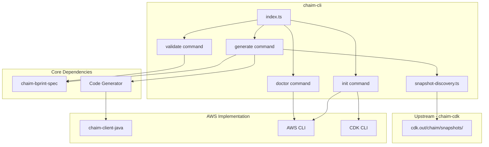
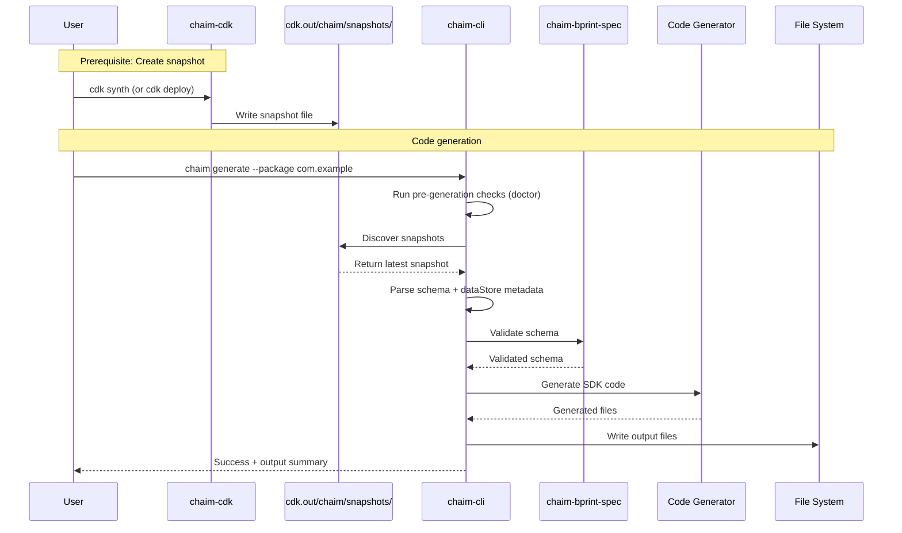
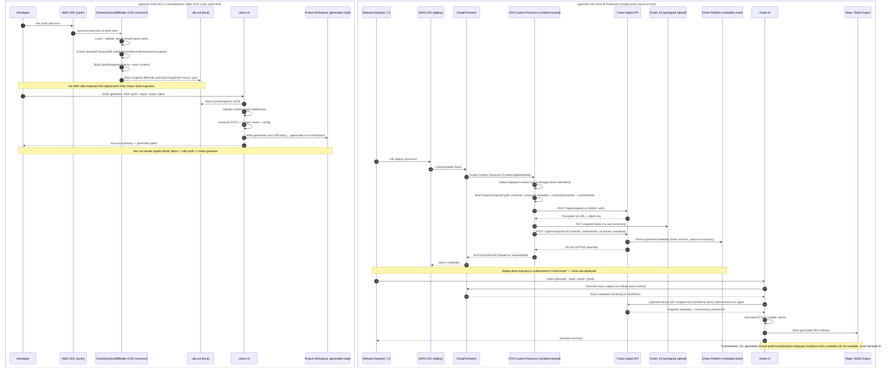
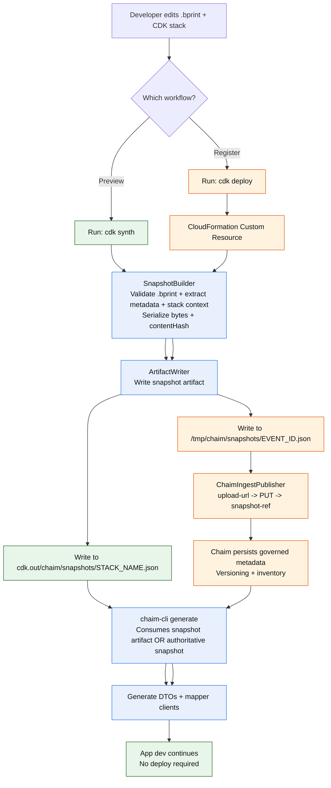

# AI Agent Context: chaim-cli

**Purpose**: Structured context for AI agents to understand and work with the chaim-cli codebase.

**Package**: `@chaim-tools/chaim` (published as `chaim` CLI binary)  
**Version**: 0.1.0  
**License**: Apache-2.0

---

## Project Overview

The chaim-cli is a **schema-driven code generation tool** that transforms `.bprint` schema definitions into complete, language-specific SDKs with data access clients, DTOs, and configuration management. It reads snapshot files produced by `chaim-cdk` to extract schema and resource configuration, then generates type-safe code.

**Current Implementation**: AWS (DynamoDB tables) with Java SDK generation.

### Prerequisite

> **IMPORTANT**: The CLI requires snapshots from `chaim-cdk`. You must run `cdk synth` or `cdk deploy` before using `chaim generate`.

```bash
# In your CDK project (creates snapshots in cdk.out/chaim/snapshots/)
cdk synth   # For development (preview mode)
cdk deploy  # For production (registered mode)

# Then run the CLI
chaim generate --package com.example.model
```

### Key Capabilities

- **Prerequisites Management**: Verify and install all required dependencies for the current provider
- **Language-Specific SDK Generation**: Generate complete SDKs from CDK snapshots (Java-first implementation)
- **Schema Validation**: Validate `.bprint` files using `@chaim-tools/chaim-bprint-spec`
- **Environment Diagnostics**: Check system environment and dependency health
- **Snapshot Discovery**: Automatically find and select the appropriate snapshot from `cdk.out/chaim/snapshots/`
- **Extensible Code Generation**: Structured to support additional language generators (e.g., Kotlin, Python) without changing schema or ingestion behavior

### Scope

This CLI currently targets **AWS-based deployments only**, consuming snapshots produced by `chaim-cdk`.

---

## Related Packages

| Package | Relationship | Purpose |
|---------|-------------|---------|
| `@chaim-tools/cdk-lib` | **Upstream dependency** | Produces snapshot files that CLI consumes |
| `@chaim-tools/chaim-bprint-spec` | **Shared dependency** | Schema format definition, validation |
| `@chaim-tools/client-java` | **Code generator** | Java SDK generation |

**Data flow**:
```
chaim-cdk (cdk synth/deploy) → cdk.out/chaim/snapshots/ → chaim-cli → Generated SDK
```

---

## Technology Stack

| Component | Technology |
|-----------|------------|
| Language | TypeScript 5.x |
| Module System | CommonJS (`"type": "commonjs"`) |
| Runtime | Node.js 18+ |
| CLI Framework | Commander.js 11.x |
| Terminal Styling | Chalk 4.x |
| Progress Spinners | Ora 5.x |
| Testing | Vitest 1.x |
| Code Quality | ESLint, TypeScript strict mode |
| Cloud Integration | AWS SDK v3 (current provider implementation) |

---

## Repository Structure

```
chaim-cli/
├── src/
│   ├── index.ts                         # CLI entry point and command registration
│   ├── commands/
│   │   ├── init.ts                      # Prerequisites verification and installation
│   │   ├── generate.ts                  # SDK generation from snapshots
│   │   ├── validate.ts                  # Schema file validation
│   │   ├── doctor.ts                    # Environment health checks
│   │   └── cloudformation-reader.ts     # DEPRECATED: Legacy CloudFormation reader
│   └── services/
│       └── snapshot-discovery.ts        # Snapshot file discovery and resolution
├── shared/
│   ├── examples/
│   │   └── orders.bprint                # Sample schema file
│   └── scripts/
│       └── setup.sh                     # Setup script for development
├── dist/                                # Compiled output (generated)
├── bundled-deps/                        # Bundled dependencies for offline/reproducible generation (generated)
├── package.json
├── tsconfig.json
└── README.md
```

---

## Architecture

### CLI Command Structure

```
chaim (CLI entry point)
├── init        # Prerequisites verification and installation
├── generate    # SDK generation from infrastructure stack
├── validate    # Schema file validation
└── doctor      # Environment health checks
```

### Component Dependencies



---

## CLI Commands

### `chaim init`

Verifies and installs all prerequisites required for the Chaim CLI to function.

```bash
chaim init [options]
```

| Option | Description | Default |
|--------|-------------|---------|
| `--install` | Install missing dependencies automatically | false |
| `--verify-only` | Verify prerequisites only (no installation) | false |
| `--region <region>` | AWS region for CDK bootstrap | us-east-1 |

**Prerequisites Checked:**
- Node.js version (requires v18+)
- Java installation (requires 11+)
- AWS CLI availability and configuration
- CDK CLI installation
- AWS credentials validity
- CDK bootstrap status

**Dependencies Installed (with `--install`):**
- CDK CLI (if missing): `npm install -g aws-cdk`
- chaim-cli dependencies
- CDK bootstrap (if not already done)

---

### `chaim generate`

Generates language-specific SDK from Chaim snapshot files produced by `chaim-cdk`.

**Prerequisite**: Run `cdk synth` or `cdk deploy` in your CDK project first.

```bash
chaim generate --package <packageName> [options]
```

| Option | Type | Required | Description | Default |
|--------|------|----------|-------------|---------|
| `--package` | string | Yes | Target package name (e.g., `com.example.model` for Java) | - |
| `--snapshot-dir` | string | No | Snapshot directory path | cdk.out/chaim/snapshots |
| `--mode` | string | No | Snapshot mode: `preview`, `registered`, or `auto` | auto |
| `--stack` | string | No | Filter snapshots by stack name | - |
| `--table` | string | No | Specific table name to generate | All tables |
| `--output` | string | No | Output directory | ./src/main/java |
| `--skip-checks` | boolean | No | Skip environment validation | false |

**Mode Selection:**
- `auto` (default): Use registered if available, else preview
- `preview`: Only use preview snapshots (cdk synth output)
- `registered`: Only use registered snapshots (cdk deploy output)

**Examples:**
```bash
# Generate from snapshot (auto-discovers mode)
chaim generate --package com.myapp.model

# Generate from preview snapshot explicitly
chaim generate --package com.myapp.model --mode preview

# Generate from registered snapshot explicitly  
chaim generate --package com.myapp.model --mode registered

# Filter by stack name
chaim generate --stack MyAppStack --package com.myapp.model
```

**Error: No snapshot found**

If no snapshot is found, the CLI will show:
- Expected snapshot locations
- Instructions to run `cdk synth` or `cdk deploy`
- Any existing snapshots that didn't match your criteria

---

### `chaim validate`

Validates a `.bprint` schema file against the Chaim specification.

```bash
chaim validate <schemaFile>
```

| Argument | Type | Required | Description |
|----------|------|----------|-------------|
| `schemaFile` | string | Yes | Path to the `.bprint` file to validate |

**Example:**
```bash
chaim validate ./schemas/user.bprint
```

**Output on Success:**
```
🔍 Validating schema: ./schemas/user.bprint
✓ Schema is valid
  Entity: userId
  Version: v1
  Fields: 5
```

---

### `chaim doctor`

Checks system environment and dependencies for proper configuration.

```bash
chaim doctor
```

**Checks Performed:**
- Node.js version
- AWS CLI availability
- AWS credentials configuration
- Java availability
- AWS SDK availability

**Example Output:**
```
🔍 Checking system environment...
✓ Node.js version: v20.10.0
✓ AWS credentials configured
  Account: 123456789012
  User: arn:aws:iam::123456789012:user/developer
✓ Java version: 17.0.9
✓ AWS SDK available
✓ All checks passed
```

---

## Snapshot Locations

The CLI reads snapshots from a standardized directory structure created by `chaim-cdk`:

```
cdk.out/chaim/snapshots/
├── preview/                    # Synth-time snapshots
│   └── <stackName>.json       # e.g., MyStack.json
└── registered/                 # Deploy-time snapshots  
    └── <stackName>-<eventId>.json  # e.g., MyStack-550e8400-e29b-41d4-a716-446655440000.json
```

### Snapshot Modes

| Mode | When Created | Contains | Purpose |
|------|--------------|----------|---------|
| `PREVIEW` | `cdk synth` | schema, dataStore, context, capturedAt | Local development, code generation without deploy |
| `REGISTERED` | `cdk deploy` | All preview fields + eventId, contentHash | Production tracking, audit trail |

### Generation Workflows

**Preview Workflow (no deploy needed):**
```bash
cdk synth
chaim generate --mode preview --package com.example.model
```

**Registered Workflow (after deploy):**
```bash
cdk deploy
chaim generate --mode registered --package com.example.model
```

**Auto Mode (default):**
```bash
chaim generate --package com.example.model  # Uses registered if available, else preview
```

---

## Snapshot Discovery

The CLI discovers and resolves snapshots from the standardized directory structure created by `chaim-cdk`.

### Discovery Logic

```typescript
// Snapshot discovery service API
function resolveSnapshot(
  snapshotDir: string,
  mode: 'preview' | 'registered' | 'auto',
  stackFilter?: string
): ResolvedSnapshot | undefined;

// Auto mode priority:
// 1. If registered snapshots exist → use latest registered
// 2. Else if preview snapshots exist → use latest preview
// 3. Else → error (no snapshot found)
```

### Snapshot Resolution

| Input | Resolution |
|-------|------------|
| `--mode auto` (default) | Prefer registered, fallback to preview |
| `--mode preview` | Only search `preview/` directory |
| `--mode registered` | Only search `registered/` directory |
| `--stack MyStack` | Filter snapshots by stack name |

### Directory Structure

```
cdk.out/chaim/snapshots/
├── preview/                    # Created by: cdk synth
│   └── <stackName>.json
└── registered/                 # Created by: cdk deploy
    └── <stackName>-<eventId>.json
```

---

## Code Generation Flow

### End-to-End Process



### Generated Output Structure (Java Example)

```
./src/main/java/
└── com/
    └── example/
        └── model/
            ├── User.java           # Entity DTO
            ├── UserRepository.java # Data store operations
            └── ChaimConfig.java    # Client configuration
```

---

## Package Exports

### npm Installation

```bash
npm install -g @chaim-tools/chaim
```

### Binary Entry Point

```bash
chaim <command> [options]
```

The CLI is registered as a global binary via `package.json`:

```json
{
  "bin": {
    "chaim": "./dist/index.js"
  }
}
```

---

## Development Commands

| Command | Purpose |
|---------|---------|
| `npm run build` | Build CLI and bundle dependencies |
| `npm run build:cli` | Compile TypeScript to dist/ |
| `npm run build:deps` | Bundle bprint-spec and cdk dependencies |
| `npm test` | Run Vitest test suite |
| `npm run lint` | Run ESLint |
| `npm run lint:fix` | Fix ESLint issues |
| `npm run dev` | Run CLI in development mode (ts-node) |
| `npm run start` | Run compiled CLI |
| `npm run clean` | Remove dist/ and bundled-deps/ |

---

## Key Files Reference

| File | Purpose |
|------|---------|
| `src/index.ts` | CLI entry point, Commander.js setup, command registration |
| `src/commands/init.ts` | Prerequisites verification and dependency installation |
| `src/commands/generate.ts` | SDK generation from snapshots |
| `src/commands/validate.ts` | Schema validation using chaim-bprint-spec |
| `src/commands/doctor.ts` | Environment health checks |
| `src/services/snapshot-discovery.ts` | Snapshot file discovery and resolution |
| `src/commands/cloudformation-reader.ts` | DEPRECATED: Legacy CloudFormation reader (not used) |
| `shared/examples/orders.bprint` | Sample schema file for testing |
| `shared/scripts/setup.sh` | Development environment setup script |

---

## Integration with Chaim Ecosystem

### Dependencies

| Package | Purpose |
|---------|---------|
| `@chaim-tools/chaim-bprint-spec` | Schema validation and TypeScript types |
| `@chaim-tools/cdk-lib` | Produces snapshot files (upstream dependency) |
| `@chaim-tools/client-java` | Code generation (Java implementation) |

### Workflow with Other Packages

1. **Define Schema** (`chaim-bprint-spec`)
   - Create `.bprint` schema files defining entity structure
   
2. **Create Snapshot** (`chaim-cdk`)
   - Bind schemas to data stores using CDK constructs
   - Run `cdk synth` (preview) or `cdk deploy` (registered)
   - Snapshots written to `cdk.out/chaim/snapshots/`
   
3. **Generate SDK** (`chaim-cli`)
   - Discover and read snapshot files
   - Validate schema using `chaim-bprint-spec`
   - Generate SDK code using language-specific generator
   - *Current*: Java code via `chaim-client-java`

---

## Configuration File (Optional)

Create `chaim.json` in your project root to avoid repeating CLI options:

```json
{
  "defaults": {
    "package": "com.example.model",
    "output": "./src/main/java",
    "region": "us-east-1",
    "stack": "MyStack"
  }
}
```

Then run without arguments:
```bash
chaim generate
```

---

## Field Type Mappings (Java)

| `.bprint` Type | Java Type |
|----------------|-----------|
| `string` | `String` |
| `number` | `Double` |
| `boolean` | `Boolean` |
| `timestamp` | `Instant` |

> Type mappings for other target languages will be documented as generators are added.

---

## Error Handling

### Common Errors

| Error | Cause | Resolution |
|-------|-------|------------|
| `No snapshot found` | Missing CDK snapshot | Run `cdk synth` or `cdk deploy` in your CDK project first |
| `--package is required` | Missing Java package | Provide `--package <name>` option |
| `Table 'X' not found in snapshot` | Invalid table name | Check table name in snapshot file |
| `AWS credentials not configured` | Missing AWS auth | Run `aws configure` |
| `Schema validation failed` | Invalid `.bprint` file | Fix schema per error message |

### No Snapshot Found

The most common error is "No snapshot found". This occurs when:

1. **CDK not run**: You haven't run `cdk synth` or `cdk deploy` yet
2. **Wrong directory**: You're running CLI from a different directory than your CDK project
3. **Mode mismatch**: You specified `--mode registered` but only have preview snapshots
4. **Stack mismatch**: You specified `--stack X` but snapshots are for stack Y

**Resolution:**
```bash
# Navigate to your CDK project directory
cd my-cdk-project

# Create a snapshot
cdk synth

# Then run the CLI
chaim generate --package com.example.model
```

---

## Testing

### Running Tests

```bash
npm test
```

### Test Files

| File | Coverage |
|------|----------|
| `src/index.test.ts` | CLI entry point |
| `src/commands/generate.test.ts` | Generate command |
| `src/commands/validate.test.ts` | Validate command |
| `src/commands/init.test.ts` | Init command |
| `src/commands/doctor.test.ts` | Doctor command |
| `src/services/snapshot-discovery.test.ts` | Snapshot discovery |

---

**Note**: This document reflects the chaim-cli architecture as a TypeScript-based CLI tool. The CLI consumes snapshot files produced by `chaim-cdk` and generates type-safe SDKs. Snapshots are required; the CLI does not fall back to CloudFormation. The current implementation targets AWS (DynamoDB) with Java SDK generation; the architecture supports extension to other target languages.




